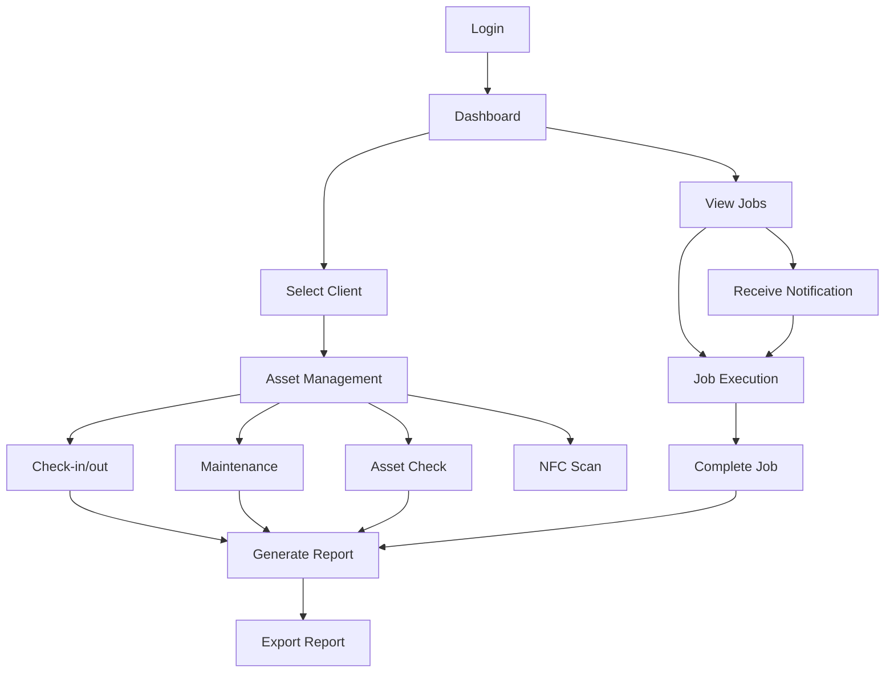

## 1. Product Overview

A mobile-first technician asset tracking application that enables field workers to manage client assets, perform maintenance, track job assignments, and generate daily reports with NFC integration for seamless asset identification and status updates.

This app solves the problem of manual asset tracking and job management for technicians working across multiple client sites, providing real-time job notifications and comprehensive reporting capabilities.

## 2. Core Features

### 2.1 User Roles

| Role | Registration Method | Core Permissions |
|------|---------------------|------------------|
| Technician | Admin invitation/registration | Full asset management, job execution, reporting |
| Admin/Client | Admin panel | Create jobs, view reports, manage technicians |

### 2.2 Feature Module

The technician asset tracking app consists of the following main screens:

1. **Dashboard**: Job overview, notifications, quick actions
2. **Clients**: Client list, add/select client, client details
3. **Assets**: Asset management, maintenance tracking, check-in/out
4. **Jobs**: Job list, job details, job execution
5. **Reports**: Daily reports, export functionality
6. **NFC**: Read/write NFC tags for asset identification

### 2.3 Page Details

| Page Name | Module Name | Feature description |
|-----------|-------------|---------------------|
| Dashboard | Job Overview | Display active jobs, upcoming tasks, job status counters |
| Dashboard | Notifications | Show push notifications for new job assignments |
| Dashboard | Quick Actions | Quick access to check-in/out, asset scan, new job |
| Clients | Client List | View all clients, search/filter functionality |
| Clients | Add Client | Create new client with contact details, location |
| Clients | Select Client | Choose active client for asset/job operations |
| Clients | Client Details | View client information, assigned assets, job history |
| Assets | Asset List | Display assets for selected client, search/filter |
| Assets | Add Asset | Register new asset with details, photos, NFC tag |
| Assets | Asset Details | View asset info, maintenance history, current status |
| Assets | Check-in/out | Update asset location and custody status |
| Assets | Maintenance | Schedule and record maintenance activities |
| Assets | Asset Check | Verify asset condition, update status |
| Jobs | Job List | View assigned jobs, filter by status/date |
| Jobs | Job Details | View job requirements, client info, assigned assets |
| Jobs | Job Execution | Start/stop job timer, update progress, add notes |
| Reports | Daily Report | Generate summary of daily activities |
| Reports | Export Report | Export reports as PDF/CSV for client sharing |
| Reports | Report History | View and access previous reports |
| NFC | Read NFC | Scan NFC tags to identify assets |
| NFC | Write NFC | Program NFC tags with asset information |
| NFC | NFC History | View NFC scan history and associated actions |

## 3. Core Process

### Technician Flow

1. **Login** → **Dashboard** (view active jobs and notifications)
2. **Select Client** → **View Assets** → **Perform Asset Operations** (check-in/out, maintenance, checks)
3. **Receive Job Notification** → **Accept Job** → **Navigate to Location** → **Execute Job** → **Complete Job**
4. **Generate Daily Report** → **Export Report** → **Share with Client**
5. **Use NFC** → **Scan Asset Tag** → **Update Asset Status**

### Admin/Client Flow

1. **Create Job** → **Assign Technician** → **Add Job Details** → **Send Notification**
2. **View Reports** → **Review Technician Activities** → **Export for Records**

## 4. User Interface Design

### 4.1 Design Style

- **Primary Colors**: Professional blue (#2563EB), white background
- **Secondary Colors**: Success green (#10B981), warning orange (#F59E0B), error red (#EF4444)
- **Button Style**: Rounded corners, clear call-to-action colors
- **Font**: Clean sans-serif (Inter/Roboto), 16px base size
- **Layout**: Card-based design with clear visual hierarchy
- **Icons**: Material Design icons for consistency

### 4.2 Page Design Overview

| Page Name | Module Name | UI Elements |
|-----------|-------------|-------------|
| Dashboard | Job Overview | Card-based job tiles, status badges, priority indicators |
| Dashboard | Notifications | Toast notifications, notification center with badges |
| Clients | Client List | Search bar, client cards with logos, quick actions |
| Assets | Asset List | Filter chips, asset cards with photos, status indicators |
| Assets | Asset Details | Image gallery, status timeline, action buttons |
| Jobs | Job List | Job cards with client info, status, estimated time |
| Jobs | Job Details | Job requirements panel, asset checklist, timer display |
| Reports | Daily Report | Summary cards, activity timeline, export button |
| NFC | NFC Interface | Large scan button, tag status, action feedback |

### 4.3 Responsiveness

- **Mobile-first design** with responsive breakpoints
- **Touch-optimized** interactions for field use
- **Offline capability** for areas with poor connectivity
- **Large touch targets** for easy operation with gloves

### 4.4 NFC Integration

- **Scan Animation**: Visual feedback during NFC read/write operations
- **Tag Programming**: Simple interface for writing asset data to NFC tags
- **Error Handling**: Clear messages for failed scans or write operations
- **History Tracking**: Log of all NFC interactions with timestamps