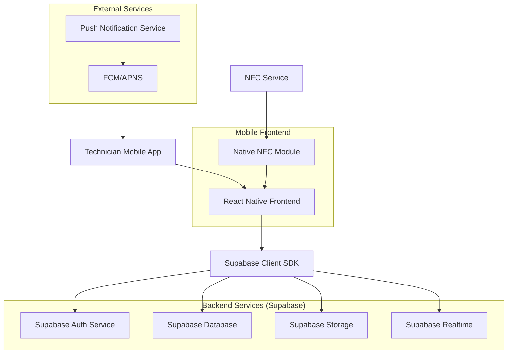
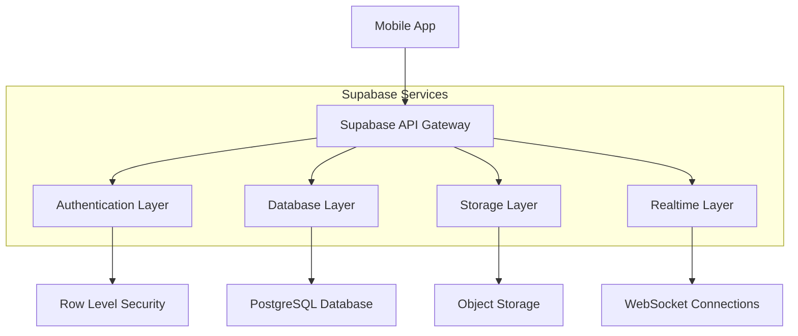
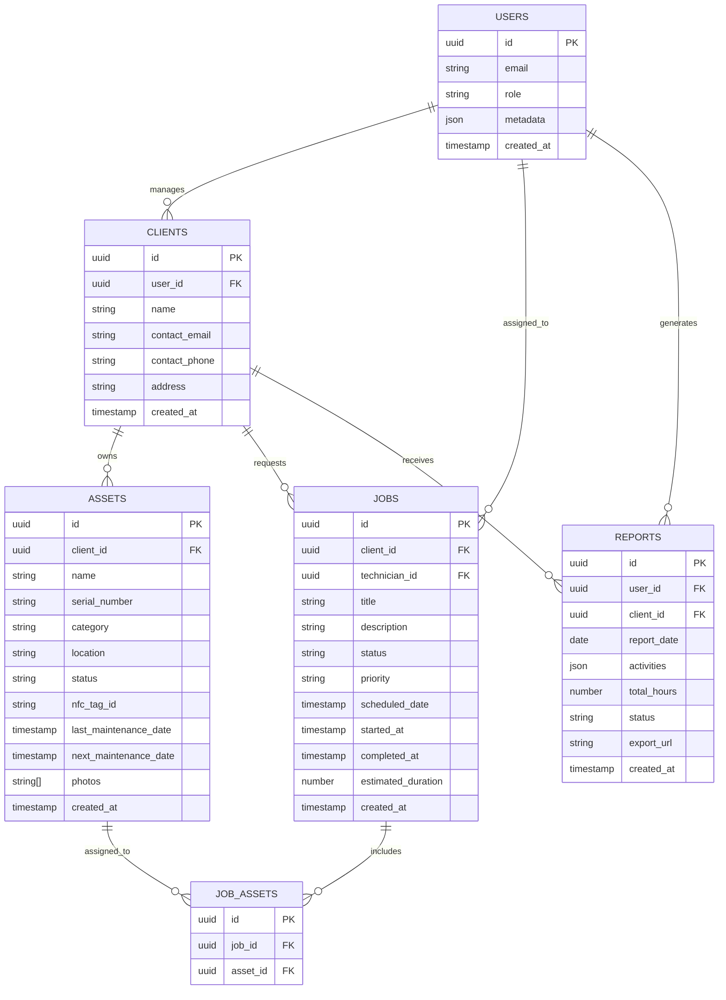

## 1. Architecture Design



## 2. Technology Description

- **Frontend**: React Native@0.72 + Native Base@3 + React Navigation@6
- **Backend**: Supabase (PostgreSQL, Auth, Storage, Realtime)
- **Push Notifications**: Firebase Cloud Messaging / Apple Push Notification Service
- **NFC Integration**: React Native NFC Manager
- **File Export**: React Native Share + PDF generation libraries
- **State Management**: React Context + Zustand

## 3. Route Definitions

| Route | Purpose |
|-------|---------|
| /dashboard | Main dashboard with job overview and notifications |
| /clients | Client management and selection |
| /clients/:id | Client details and associated assets |
| /assets | Asset list for selected client |
| /assets/:id | Asset details and operations |
| /assets/add | Add new asset form |
| /jobs | Job list and management |
| /jobs/:id | Job details and execution |
| /reports | Report generation and export |
| /nfc | NFC scanning and programming |
| /profile | User profile and settings |

## 4. API Definitions

### 4.1 Core API Endpoints

**Authentication**
```
POST /auth/v1/token
GET /auth/v1/user
POST /auth/v1/logout
```

**Clients Management**
```
GET /rest/v1/clients
POST /rest/v1/clients
GET /rest/v1/clients?id=eq.{id}
PATCH /rest/v1/clients?id=eq.{id}
```

**Assets Management**
```
GET /rest/v1/assets?client_id=eq.{client_id}
POST /rest/v1/assets
GET /rest/v1/assets?id=eq.{id}
PATCH /rest/v1/assets?id=eq.{id}
```

**Jobs Management**
```
GET /rest/v1/jobs?technician_id=eq.{user_id}
POST /rest/v1/jobs
PATCH /rest/v1/jobs?id=eq.{id}
```

**Reports Generation**
```
POST /rest/v1/reports
GET /rest/v1/reports?user_id=eq.{user_id}&date=eq.{date}
```

### 4.2 TypeScript Type Definitions

```typescript
interface Client {
  id: string;
  name: string;
  contact_email: string;
  contact_phone: string;
  address: string;
  created_at: string;
}

interface Asset {
  id: string;
  client_id: string;
  name: string;
  serial_number: string;
  category: string;
  location: string;
  status: 'available' | 'checked_out' | 'maintenance' | 'retired';
  nfc_tag_id?: string;
  last_maintenance_date?: string;
  next_maintenance_date?: string;
  photos: string[];
}

interface Job {
  id: string;
  client_id: string;
  technician_id: string;
  title: string;
  description: string;
  status: 'pending' | 'in_progress' | 'completed' | 'cancelled';
  priority: 'low' | 'medium' | 'high';
  scheduled_date: string;
  started_at?: string;
  completed_at?: string;
  estimated_duration: number;
  assets: string[];
}

interface Report {
  id: string;
  user_id: string;
  client_id: string;
  date: string;
  activities: Activity[];
  total_hours: number;
  status: 'draft' | 'submitted';
  export_url?: string;
}

interface Activity {
  id: string;
  type: 'check_in' | 'check_out' | 'maintenance' | 'job_execution';
  asset_id?: string;
  job_id?: string;
  timestamp: string;
  duration?: number;
  notes?: string;
}
```

## 5. Server Architecture Diagram



## 6. Data Model

### 6.1 Data Model Definition



### 6.2 Data Definition Language

**Users Table**
```sql
-- Create users table (managed by Supabase Auth)
-- Additional user profile data
CREATE TABLE user_profiles (
  id UUID PRIMARY KEY REFERENCES auth.users(id) ON DELETE CASCADE,
  role VARCHAR(20) DEFAULT 'technician' CHECK (role IN ('technician', 'admin')),
  phone VARCHAR(20),
  created_at TIMESTAMP WITH TIME ZONE DEFAULT NOW(),
  updated_at TIMESTAMP WITH TIME ZONE DEFAULT NOW()
);

-- Enable RLS
ALTER TABLE user_profiles ENABLE ROW LEVEL SECURITY;

-- Policies
CREATE POLICY "Users can view their own profile" ON user_profiles
  FOR SELECT USING (auth.uid() = id);

CREATE POLICY "Users can update their own profile" ON user_profiles
  FOR UPDATE USING (auth.uid() = id);
```

**Clients Table**
```sql
-- Create clients table
CREATE TABLE clients (
  id UUID PRIMARY KEY DEFAULT gen_random_uuid(),
  user_id UUID REFERENCES auth.users(id) ON DELETE CASCADE,
  name VARCHAR(255) NOT NULL,
  contact_email VARCHAR(255),
  contact_phone VARCHAR(20),
  address TEXT,
  created_at TIMESTAMP WITH TIME ZONE DEFAULT NOW(),
  updated_at TIMESTAMP WITH TIME ZONE DEFAULT NOW()
);

-- Enable RLS
ALTER TABLE clients ENABLE ROW LEVEL SECURITY;

-- Policies
CREATE POLICY "Users can view their own clients" ON clients
  FOR SELECT USING (auth.uid() = user_id);

CREATE POLICY "Users can create clients" ON clients
  FOR INSERT WITH CHECK (auth.uid() = user_id);

CREATE POLICY "Users can update their own clients" ON clients
  FOR UPDATE USING (auth.uid() = user_id);

-- Indexes
CREATE INDEX idx_clients_user_id ON clients(user_id);
CREATE INDEX idx_clients_created_at ON clients(created_at DESC);
```

**Assets Table**
```sql
-- Create assets table
CREATE TABLE assets (
  id UUID PRIMARY KEY DEFAULT gen_random_uuid(),
  client_id UUID REFERENCES clients(id) ON DELETE CASCADE,
  name VARCHAR(255) NOT NULL,
  serial_number VARCHAR(100),
  category VARCHAR(100),
  location VARCHAR(255),
  status VARCHAR(20) DEFAULT 'available' CHECK (status IN ('available', 'checked_out', 'maintenance', 'retired')),
  nfc_tag_id VARCHAR(100) UNIQUE,
  last_maintenance_date TIMESTAMP WITH TIME ZONE,
  next_maintenance_date TIMESTAMP WITH TIME ZONE,
  photos TEXT[],
  created_at TIMESTAMP WITH TIME ZONE DEFAULT NOW(),
  updated_at TIMESTAMP WITH TIME ZONE DEFAULT NOW()
);

-- Enable RLS
ALTER TABLE assets ENABLE ROW LEVEL SECURITY;

-- Policies
CREATE POLICY "Users can view assets for their clients" ON assets
  FOR SELECT USING (EXISTS (
    SELECT 1 FROM clients 
    WHERE clients.id = assets.client_id 
    AND clients.user_id = auth.uid()
  ));

CREATE POLICY "Users can create assets for their clients" ON assets
  FOR INSERT WITH CHECK (EXISTS (
    SELECT 1 FROM clients 
    WHERE clients.id = assets.client_id 
    AND clients.user_id = auth.uid()
  ));

-- Indexes
CREATE INDEX idx_assets_client_id ON assets(client_id);
CREATE INDEX idx_assets_status ON assets(status);
CREATE INDEX idx_assets_nfc_tag ON assets(nfc_tag_id);
```

**Jobs Table**
```sql
-- Create jobs table
CREATE TABLE jobs (
  id UUID PRIMARY KEY DEFAULT gen_random_uuid(),
  client_id UUID REFERENCES clients(id) ON DELETE CASCADE,
  technician_id UUID REFERENCES auth.users(id) ON DELETE CASCADE,
  title VARCHAR(255) NOT NULL,
  description TEXT,
  status VARCHAR(20) DEFAULT 'pending' CHECK (status IN ('pending', 'in_progress', 'completed', 'cancelled')),
  priority VARCHAR(10) DEFAULT 'medium' CHECK (priority IN ('low', 'medium', 'high')),
  scheduled_date DATE NOT NULL,
  started_at TIMESTAMP WITH TIME ZONE,
  completed_at TIMESTAMP WITH TIME ZONE,
  estimated_duration INTEGER,
  created_at TIMESTAMP WITH TIME ZONE DEFAULT NOW(),
  updated_at TIMESTAMP WITH TIME ZONE DEFAULT NOW()
);

-- Enable RLS
ALTER TABLE jobs ENABLE ROW LEVEL SECURITY;

-- Policies
CREATE POLICY "Technicians can view their assigned jobs" ON jobs
  FOR SELECT USING (auth.uid() = technician_id);

CREATE POLICY "Users can view jobs for their clients" ON jobs
  FOR SELECT USING (EXISTS (
    SELECT 1 FROM clients 
    WHERE clients.id = jobs.client_id 
    AND clients.user_id = auth.uid()
  ));

-- Indexes
CREATE INDEX idx_jobs_technician_id ON jobs(technician_id);
CREATE INDEX idx_jobs_client_id ON jobs(client_id);
CREATE INDEX idx_jobs_status ON jobs(status);
CREATE INDEX idx_jobs_scheduled_date ON jobs(scheduled_date);
```

**Reports Table**
```sql
-- Create reports table
CREATE TABLE reports (
  id UUID PRIMARY KEY DEFAULT gen_random_uuid(),
  user_id UUID REFERENCES auth.users(id) ON DELETE CASCADE,
  client_id UUID REFERENCES clients(id) ON DELETE CASCADE,
  report_date DATE NOT NULL,
  activities JSONB NOT NULL DEFAULT '[]',
  total_hours DECIMAL(4,2) DEFAULT 0,
  status VARCHAR(20) DEFAULT 'draft' CHECK (status IN ('draft', 'submitted')),
  export_url TEXT,
  created_at TIMESTAMP WITH TIME ZONE DEFAULT NOW(),
  updated_at TIMESTAMP WITH TIME ZONE DEFAULT NOW()
);

-- Enable RLS
ALTER TABLE reports ENABLE ROW LEVEL SECURITY;

-- Policies
CREATE POLICY "Users can view their own reports" ON reports
  FOR SELECT USING (auth.uid() = user_id);

CREATE POLICY "Users can create reports" ON reports
  FOR INSERT WITH CHECK (auth.uid() = user_id);

-- Indexes
CREATE INDEX idx_reports_user_id ON reports(user_id);
CREATE INDEX idx_reports_client_id ON reports(client_id);
CREATE INDEX idx_reports_date ON reports(report_date);
```

### 6.3 Supabase Realtime Configuration

```sql
-- Enable realtime for jobs table to push notifications
ALTER TABLE jobs REPLICA IDENTITY FULL;

-- Enable realtime for assets table to sync status changes
ALTER TABLE assets REPLICA IDENTITY FULL;
```

### 6.4 Push Notification Setup

```sql
-- Add device tokens table for push notifications
CREATE TABLE device_tokens (
  id UUID PRIMARY KEY DEFAULT gen_random_uuid(),
  user_id UUID REFERENCES auth.users(id) ON DELETE CASCADE,
  token TEXT NOT NULL,
  platform VARCHAR(10) CHECK (platform IN ('ios', 'android')),
  created_at TIMESTAMP WITH TIME ZONE DEFAULT NOW()
);

-- Enable RLS
ALTER TABLE device_tokens ENABLE ROW LEVEL SECURITY;

-- Policies
CREATE POLICY "Users can manage their own device tokens" ON device_tokens
  FOR ALL USING (auth.uid() = user_id);
```