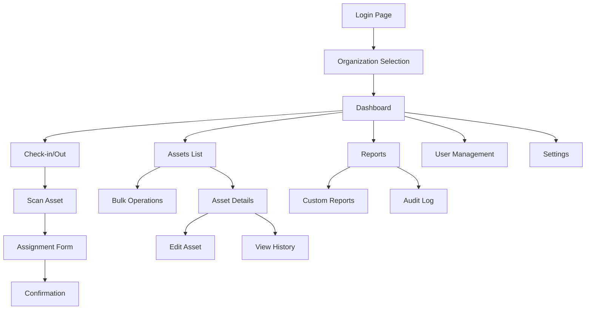

## 1. Product Overview
Asset tracking application for organizations to manage physical assets throughout their lifecycle. Replace spreadsheets with a centralized system that provides real-time visibility, accountability, and compliance tracking for equipment, tools, and inventory.

Organizations can track asset location, status, assignments, maintenance schedules, and generate compliance reports. Multi-tenant architecture allows different organizations to manage their assets independently with role-based access control.

## 2. Core Features

### 2.1 User Roles
| Role | Registration Method | Core Permissions |
|------|---------------------|------------------|
| Super Admin | System initialization | Manage organizations, system settings, global reports |
| Organization Admin | Organization invitation/registration | Manage organization settings, users, all assets, reports |
| Manager | Organization Admin invitation | Manage assigned departments, approve asset requests, view reports |
| Standard User | Organization invitation | View assigned assets, request assets, update asset status |
| Auditor | Organization Admin assignment | View-only access to all assets, audit logs, compliance reports |

### 2.2 Feature Module
Our asset tracking requirements consist of the following main pages:
1. **Dashboard**: Asset overview, quick stats, recent activities, pending actions.
2. **Assets**: Asset list, advanced filtering, bulk operations, import/export.
3. **Asset Details**: Complete asset information, history timeline, documents, maintenance schedule.
4. **Check-in/Out**: Asset assignment workflow, barcode/QR code scanning, digital signatures.
5. **Users & Roles**: User management, role assignment, department organization.
6. **Reports & Analytics**: Asset utilization, depreciation, compliance, custom reports.
7. **Audit Log**: Complete activity history, filterable by user, asset, date range.
8. **Settings**: Organization profile, custom fields, notification preferences, integrations.
9. **NFC Management**: NFC tag programming, asset association, tag scanning interface.

### 2.3 Page Details
| Page Name | Module Name | Feature description |
|-----------|-------------|---------------------|
| Dashboard | Overview Cards | Display total assets, checked out items, overdue returns, low stock alerts with real-time updates. |
| Dashboard | Activity Feed | Show recent check-ins/outs, maintenance completions, asset additions with user attribution and timestamps. |
| Dashboard | Quick Actions | Provide shortcuts for common tasks: add asset, check out, run report, scan barcode. |
| Assets | Asset List | Display paginated table with sortable columns, show asset ID, name, category, status, location, assigned user. |
| Assets | Advanced Filter | Filter by status, category, location, department, assigned user, date range, custom fields with saveable presets. |
| Assets | Bulk Operations | Select multiple assets for mass status updates, location changes, user reassignments, or data exports. |
| Assets | Import/Export | Upload CSV/Excel files for bulk asset creation, export filtered results to PDF/Excel with customizable templates. |
| Asset Details | Header Info | Show asset image, name, ID, category, status badge, current location, assigned user with quick action buttons. |
| Asset Details | Specifications | Display technical details, purchase info, warranty dates, custom fields in organized sections. |
| Asset Details | History Timeline | Chronological view of all asset activities: check-ins/outs, maintenance, location changes, status updates. |
| Asset Details | Documents | Attach and view manuals, warranties, photos, certificates with version control and access permissions. |
| Asset Details | Maintenance | Schedule and track maintenance tasks, set reminders, record completion dates, attach service reports. |
| Check-in/Out | Scan Interface | Camera-based barcode/QR code scanner with manual entry fallback, validate asset availability. |
| Check-in/Out | Assignment Form | Capture user assignment, expected return date, purpose, condition assessment, digital signature requirement. |
| Check-in/Out | Confirmation | Generate transaction ID, email notifications, update asset status, create audit log entry. |
| Users & Roles | User List | Display organization users with search, filter by role/department, show last activity and asset assignments. |
| Users & Roles | Role Management | Define custom roles with granular permissions for asset categories, locations, and actions. |
| Users & Roles | Departments | Create hierarchical department structure, assign managers, set approval workflows for asset requests. |
| Reports & Analytics | Asset Utilization | Calculate usage rates, idle time, ROI analysis with visual charts and exportable data. |
| Reports & Analytics | Compliance Reports | Generate reports for insurance, accounting, regulatory compliance with customizable templates. |
| Reports & Analytics | Custom Reports | Build custom queries with drag-and-drop interface, save and schedule automated report generation. |
| Audit Log | Activity Search | Search and filter all system activities by user, asset, action type, date range with full-text search. |
| Audit Log | Export & Archive | Export audit trails for compliance, set retention policies, maintain data integrity with cryptographic signing. |
| Settings | Organization Profile | Configure company info, logo, timezone, currency, fiscal year settings for consistent reporting. |
| Settings | Custom Fields | Create custom asset fields with validation rules, required/optional settings, field dependencies. |
| Settings | Notifications | Configure email/SMS alerts for due dates, low inventory, maintenance reminders, approval requests. |
| Settings | Integrations | Connect with accounting systems, HR databases, single sign-on providers via API or pre-built connectors. |
| NFC Management | Tag Programming | Write asset information to NFC tags including asset ID, name, and basic details with encryption. |
| NFC Management | Asset Association | Link NFC tags to existing assets, verify tag functionality, manage tag lifecycle and replacement. |
| NFC Management | Scan Interface | Mobile-optimized NFC scanning with vibration feedback, asset details display, quick actions for check-in/out. |
| NFC Management | Bulk Operations | Program multiple NFC tags simultaneously, validate tag data integrity, generate tag usage reports. |

## 3. Core Process

### Standard User Flow
1. User logs into organization-specific subdomain with credentials
2. Dashboard displays relevant assets and pending actions based on user role
3. User can search assets, view details, or initiate check-out requests
4. For check-out: scan asset (NFC/barcode/QR) → confirm availability → provide assignment details → digital signature → confirmation
5. For check-in: scan asset (NFC/barcode/QR) → assess condition → confirm return → update status

### NFC Asset Management Flow
1. **Asset Creation with NFC**: Create asset record → program NFC tag → attach tag to physical asset → verify functionality
2. **NFC Check-out**: Tap NFC tag → verify asset details → confirm assignment → complete transaction → update status
3. **NFC Check-in**: Tap NFC tag → display asset info → assess condition → confirm return → complete transaction
4. **Tag Replacement**: Scan old tag → verify asset association → program new tag → update asset record → retire old tag

### Manager Flow
1. Access dashboard with department-specific overview and approval queues
2. Review and approve asset requests from team members
3. Generate utilization reports for budget planning and compliance
4. Manage team member assignments and asset allocations

### Organization Admin Flow
1. Configure organization settings, custom fields, and user roles
2. Import bulk assets and set up automated workflows
3. Monitor organization-wide metrics and compliance status
4. Generate executive reports and manage integrations

### System Flow

## 4. User Interface Design

### 4.1 Design Style
- **Primary Colors**: Professional blue (#2563EB) for primary actions, green (#059669) for success states, amber (#D97706) for warnings
- **Secondary Colors**: Gray scale for neutral elements, red (#DC2626) for errors/deletions
- **Button Style**: Rounded corners (8px radius), clear hover states, consistent sizing hierarchy
- **Typography**: Inter font family, 14px base size, clear hierarchy with font weights (400, 500, 600, 700)
- **Layout**: Card-based design with consistent spacing (8px grid system), sticky navigation, responsive sidebar
- **Icons**: Heroicons icon set, consistent 20px/24px sizes, meaningful tooltips for all interactive elements

### 4.2 Page Design Overview
| Page Name | Module Name | UI Elements |
|-----------|-------------|-------------|
| Dashboard | Overview Cards | Grid layout with 4-column cards, gradient backgrounds, large numeric displays, subtle animations on data refresh. |
| Dashboard | Activity Feed | Timeline design with user avatars, timestamp badges, color-coded activity types, infinite scroll pagination. |
| Assets | Asset List | Data table with sticky headers, column resizing, row hover effects, inline status badges, bulk selection checkboxes. |
| Asset Details | Header Section | Hero image carousel, prominent status indicator, action button group, breadcrumb navigation. |
| Asset Details | History Timeline | Vertical timeline with icons, collapsible entries, filter chips, export button with dropdown options. |
| Check-in/Out | Scanner Interface | Full-screen modal with camera viewport, barcode overlay guides, manual entry toggle, flash controls. |
| Reports | Analytics Charts | Interactive charts using Chart.js, date range picker, chart type selector, data table toggle. |
| User Management | User Table | Avatar display, role badges, activity indicators, quick action menu, department grouping. |

### 4.3 Responsiveness
Desktop-first design approach with responsive breakpoints:
- Desktop: 1280px+ (full sidebar, multi-column layouts)
- Tablet: 768px-1279px (collapsible sidebar, adjusted grids)
- Mobile: <768px (bottom navigation, stacked cards, touch-optimized interactions)

Touch interaction optimization includes larger tap targets (44px minimum), swipe gestures for navigation, and camera-based input methods for field operations.

### 4.5 NFC Integration Requirements
**Hardware Compatibility**: Support for NFC-enabled devices (Android Chrome, iOS Safari 13+, Windows 10+ with compatible hardware)
**Tag Standards**: Compatible with NTAG213/215/216, MIFARE Ultralight, and other standard NFC Forum Type 2 tags
**Data Format**: JSON-based data structure with asset ID, timestamp, checksum, and optional encrypted payload
**Security**: AES-128 encryption for sensitive data, tamper-evident tagging, secure key management per organization
**User Experience**: Haptic feedback on successful scan, visual confirmation with asset details, offline capability with sync queue
**Tag Lifecycle**: Support for tag programming, verification, replacement, and retirement workflows with audit trail

### 4.6 Multi-tenant Considerations
- Organization-specific subdomains (company.assettrack.app)
- Branded login pages with organization logos
- Isolated data with organization-scoped queries
- Customizable fields and workflows per organization
- White-label options for enterprise customers