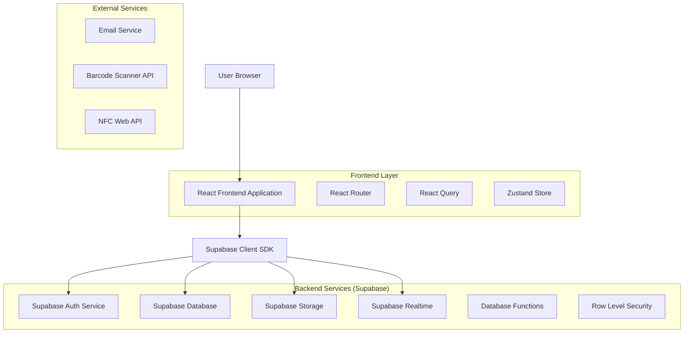
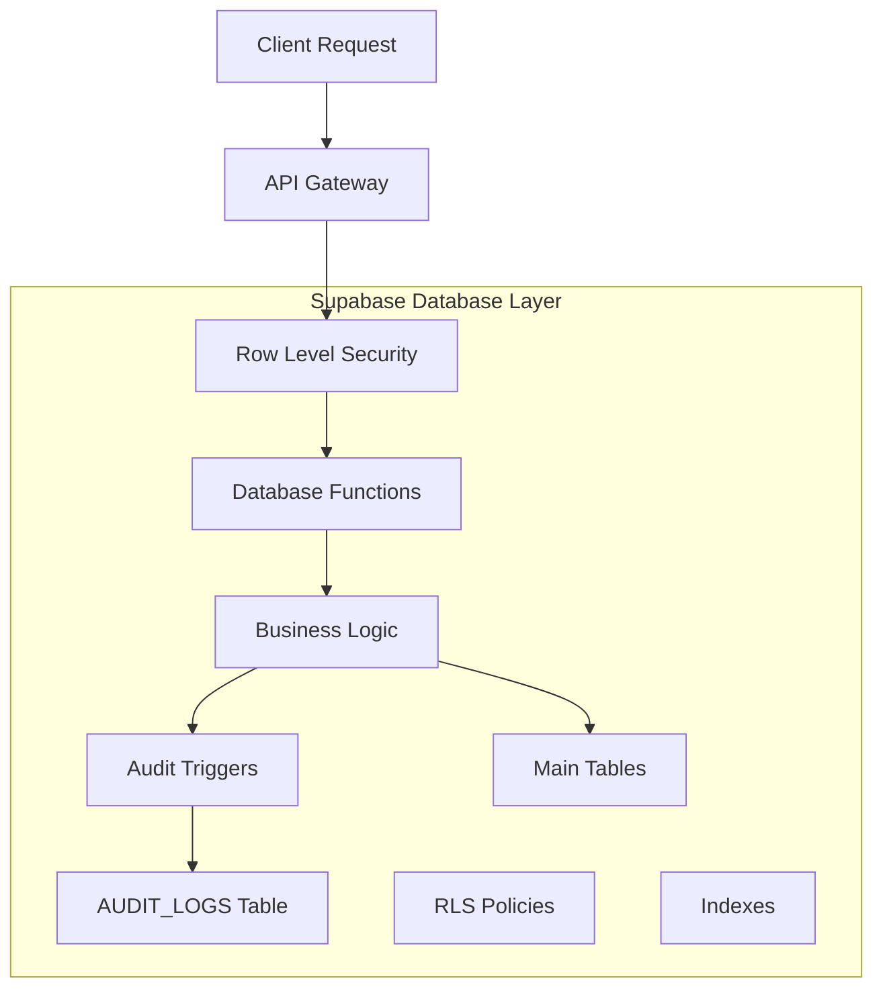
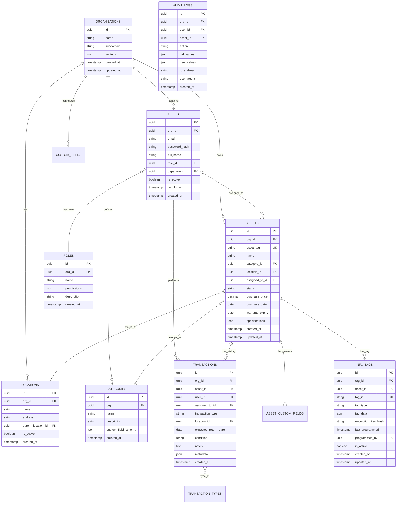

## 1. Architecture design



## 2. Technology Description
- Frontend: React@18 + TypeScript + TailwindCSS@3 + Vite
- Initialization Tool: vite-init
- Backend: Supabase (PostgreSQL, Auth, Storage, Realtime)
- State Management: Zustand for global state, React Query for server state
- UI Components: HeadlessUI + Heroicons
- Form Handling: React Hook Form + Zod validation
- Charts: Chart.js + React Chart.js 2
- 3D/AR: Three.js (for advanced asset visualization)
- NFC: Web NFC API with fallback to native mobile apps for older devices

## 3. Route definitions
| Route | Purpose |
|-------|---------|
| / | Landing page with product information and login |
| /:org/dashboard | Main dashboard with asset overview and quick actions |
| /:org/assets | Asset list with filtering and bulk operations |
| /:org/assets/:id | Individual asset details and history |
| /:org/assets/new | Create new asset form |
| /:org/checkin | Asset check-in interface with scanner |
| /:org/checkout | Asset check-out workflow |
| /:org/users | User management and role assignment |
| /:org/reports | Analytics and reporting dashboard |
| /:org/audit-log | Complete activity audit trail |
| /:org/settings | Organization configuration and preferences |
| /:org/nfc/program | NFC tag programming interface |
| /:org/nfc/scan | NFC scanning and asset identification |
| /:org/nfc/manage | NFC tag management and bulk operations |
| /auth/login | Organization-specific login page |
| /auth/register | User registration with organization invite |
| /auth/forgot-password | Password recovery workflow |

## 4. API definitions

### 4.1 Authentication APIs
```
POST /auth/v1/token
```
Request:
```json
{
  "email": "user@company.com",
  "password": "securepassword",
  "org_id": "org_uuid"
}
```
Response:
```json
{
  "access_token": "jwt_token",
  "refresh_token": "refresh_token",
  "user": {
    "id": "user_uuid",
    "email": "user@company.com",
    "role": "manager",
    "org_id": "org_uuid"
  }
}
```

### 4.2 Asset Management APIs
```
GET /rest/v1/assets
```
Query Parameters:
- org_id: Organization UUID (required)
- status: active|checked_out|maintenance|retired
- category: Equipment|Tool|Vehicle|IT|Furniture
- location_id: Location UUID
- assigned_to: User UUID
- page: Page number
- limit: Items per page

Response:
```json
{
  "data": [
    {
      "id": "asset_uuid",
      "asset_tag": "EQ-001",
      "name": "Laptop Dell XPS 15",
      "category": "IT",
      "status": "checked_out",
      "location": {
        "id": "location_uuid",
        "name": "Main Office"
      },
      "assigned_to": {
        "id": "user_uuid",
        "name": "John Doe"
      },
      "purchase_date": "2023-01-15",
      "warranty_expiry": "2026-01-15",
      "custom_fields": {}
    }
  ],
  "count": 150,
  "total_pages": 15
}
```

```
POST /rest/v1/assets
```
Request:
```json
{
  "org_id": "org_uuid",
  "asset_tag": "EQ-002",
  "name": "iPad Pro 12.9",
  "category": "IT",
  "description": "Tablet for field operations",
  "purchase_date": "2024-01-01",
  "purchase_price": 1099.00,
  "vendor": "Apple Store",
  "warranty_months": 12,
  "custom_fields": {
    "color": "Space Gray",
    "storage": "256GB"
  }
}
```

### 4.3 Check-in/Out APIs
```
POST /rest/v1/transactions
```
Request:
```json
{
  "asset_id": "asset_uuid",
  "transaction_type": "check_out",
  "user_id": "user_uuid",
  "assigned_to_id": "assignee_uuid",
  "expected_return_date": "2024-02-01",
  "purpose": "Client presentation",
  "condition": "excellent",
  "location_id": "location_uuid",
  "digital_signature": "base64_signature_data"
}
```

### 4.4 Audit Log APIs
```
GET /rest/v1/audit_logs
```
Query Parameters:
- org_id: Organization UUID (required)
- user_id: Filter by user
- asset_id: Filter by asset
- action: create|update|delete|check_in|check_out
- start_date: ISO date string
- end_date: ISO date string

Response:
```json
{
  "data": [
    {
      "id": "audit_uuid",
      "timestamp": "2024-01-15T10:30:00Z",
      "user": {
        "id": "user_uuid",
        "name": "Jane Smith",
        "email": "jane@company.com"
      },
      "action": "check_out",
      "asset": {
        "id": "asset_uuid",
        "name": "Laptop Dell XPS 15",
        "asset_tag": "EQ-001"
      },
      "details": {
        "assigned_to": "John Doe",
        "expected_return": "2024-02-01",
        "location": "Conference Room A"
      },
      "ip_address": "192.168.1.100",
      "user_agent": "Mozilla/5.0..."
    }
  ]
}
```

### 4.5 NFC APIs
```
POST /rest/v1/nfc/program
```
Request:
```json
{
  "asset_id": "asset_uuid",
  "tag_data": {
    "asset_id": "asset_uuid",
    "asset_tag": "EQ-001",
    "name": "Laptop Dell XPS 15",
    "checksum": "sha256_hash"
  },
  "encryption_key": "org_specific_key",
  "tag_type": "NTAG215"
}
```

```
GET /rest/v1/nfc/scan
```
Response:
```json
{
  "asset": {
    "id": "asset_uuid",
    "asset_tag": "EQ-001",
    "name": "Laptop Dell XPS 15",
    "status": "available",
    "assigned_to": null,
    "location": {
      "id": "location_uuid",
      "name": "Main Office"
    }
  },
  "tag_info": {
    "tag_id": "nfc_tag_uuid",
    "last_programmed": "2024-01-15T10:30:00Z",
    "programmed_by": "user_uuid",
    "data_integrity": "valid"
  }
}
```

## 5. Server architecture diagram



## 6. Data model

### 6.1 Data model definition


### 6.2 Data Definition Language

```sql
-- Organizations table
CREATE TABLE organizations (
    id UUID PRIMARY KEY DEFAULT gen_random_uuid(),
    name VARCHAR(255) NOT NULL,
    subdomain VARCHAR(100) UNIQUE NOT NULL,
    settings JSONB DEFAULT '{}',
    created_at TIMESTAMP WITH TIME ZONE DEFAULT NOW(),
    updated_at TIMESTAMP WITH TIME ZONE DEFAULT NOW()
);

-- Users table with multi-tenant isolation
CREATE TABLE users (
    id UUID PRIMARY KEY DEFAULT gen_random_uuid(),
    org_id UUID NOT NULL REFERENCES organizations(id) ON DELETE CASCADE,
    email VARCHAR(255) NOT NULL,
    password_hash VARCHAR(255) NOT NULL,
    full_name VARCHAR(255) NOT NULL,
    role_id UUID NOT NULL,
    department_id UUID,
    is_active BOOLEAN DEFAULT true,
    last_login TIMESTAMP WITH TIME ZONE,
    created_at TIMESTAMP WITH TIME ZONE DEFAULT NOW(),
    UNIQUE(org_id, email)
);

-- Roles table with organization-specific permissions
CREATE TABLE roles (
    id UUID PRIMARY KEY DEFAULT gen_random_uuid(),
    org_id UUID NOT NULL REFERENCES organizations(id) ON DELETE CASCADE,
    name VARCHAR(100) NOT NULL,
    permissions JSONB NOT NULL DEFAULT '{}',
    description TEXT,
    created_at TIMESTAMP WITH TIME ZONE DEFAULT NOW(),
    UNIQUE(org_id, name)
);

-- Assets table with lifecycle tracking
CREATE TABLE assets (
    id UUID PRIMARY KEY DEFAULT gen_random_uuid(),
    org_id UUID NOT NULL REFERENCES organizations(id) ON DELETE CASCADE,
    asset_tag VARCHAR(100) NOT NULL,
    name VARCHAR(255) NOT NULL,
    category_id UUID NOT NULL,
    location_id UUID,
    assigned_to_id UUID REFERENCES users(id),
    status VARCHAR(50) NOT NULL DEFAULT 'active',
    purchase_price DECIMAL(10,2),
    purchase_date DATE,
    warranty_expiry DATE,
    specifications JSONB DEFAULT '{}',
    created_at TIMESTAMP WITH TIME ZONE DEFAULT NOW(),
    updated_at TIMESTAMP WITH TIME ZONE DEFAULT NOW(),
    UNIQUE(org_id, asset_tag)
);

-- Categories table for asset classification
CREATE TABLE categories (
    id UUID PRIMARY KEY DEFAULT gen_random_uuid(),
    org_id UUID NOT NULL REFERENCES organizations(id) ON DELETE CASCADE,
    name VARCHAR(100) NOT NULL,
    description TEXT,
    custom_field_schema JSONB DEFAULT '[]',
    created_at TIMESTAMP WITH TIME ZONE DEFAULT NOW(),
    UNIQUE(org_id, name)
);

-- Locations table for hierarchical asset placement
CREATE TABLE locations (
    id UUID PRIMARY KEY DEFAULT gen_random_uuid(),
    org_id UUID NOT NULL REFERENCES organizations(id) ON DELETE CASCADE,
    name VARCHAR(255) NOT NULL,
    address TEXT,
    parent_location_id UUID REFERENCES locations(id),
    is_active BOOLEAN DEFAULT true,
    created_at TIMESTAMP WITH TIME ZONE DEFAULT NOW()
);

-- Transactions table for check-in/out history
CREATE TABLE transactions (
    id UUID PRIMARY KEY DEFAULT gen_random_uuid(),
    org_id UUID NOT NULL REFERENCES organizations(id) ON DELETE CASCADE,
    asset_id UUID NOT NULL REFERENCES assets(id),
    user_id UUID NOT NULL REFERENCES users(id),
    assigned_to_id UUID REFERENCES users(id),
    transaction_type VARCHAR(50) NOT NULL,
    location_id UUID REFERENCES locations(id),
    expected_return_date DATE,
    condition VARCHAR(50),
    notes TEXT,
    metadata JSONB DEFAULT '{}',
    created_at TIMESTAMP WITH TIME ZONE DEFAULT NOW()
);

-- Audit logs table for compliance tracking
CREATE TABLE audit_logs (
    id UUID PRIMARY KEY DEFAULT gen_random_uuid(),
    org_id UUID NOT NULL REFERENCES organizations(id) ON DELETE CASCADE,
    user_id UUID REFERENCES users(id),
    asset_id UUID REFERENCES assets(id),
    action VARCHAR(100) NOT NULL,
    old_values JSONB,
    new_values JSONB,
    ip_address INET,
    user_agent TEXT,
    created_at TIMESTAMP WITH TIME ZONE DEFAULT NOW()
);

-- NFC tags table for asset tagging
CREATE TABLE nfc_tags (
    id UUID PRIMARY KEY DEFAULT gen_random_uuid(),
    org_id UUID NOT NULL REFERENCES organizations(id) ON DELETE CASCADE,
    asset_id UUID REFERENCES assets(id) ON DELETE SET NULL,
    tag_id VARCHAR(100) NOT NULL UNIQUE,
    tag_type VARCHAR(50) NOT NULL DEFAULT 'NTAG215',
    tag_data JSONB NOT NULL DEFAULT '{}',
    encryption_key_hash VARCHAR(255),
    last_programmed TIMESTAMP WITH TIME ZONE DEFAULT NOW(),
    programmed_by UUID REFERENCES users(id),
    is_active BOOLEAN DEFAULT true,
    created_at TIMESTAMP WITH TIME ZONE DEFAULT NOW(),
    updated_at TIMESTAMP WITH TIME ZONE DEFAULT NOW(),
    UNIQUE(org_id, tag_id)
);

-- Row Level Security Policies
-- Ensure users can only see their organization's data
ALTER TABLE users ENABLE ROW LEVEL SECURITY;
ALTER TABLE assets ENABLE ROW LEVEL SECURITY;
ALTER TABLE transactions ENABLE ROW LEVEL SECURITY;
ALTER TABLE audit_logs ENABLE ROW LEVEL SECURITY;
ALTER TABLE nfc_tags ENABLE ROW LEVEL SECURITY;

-- Users RLS: Users can only see users in their organization
CREATE POLICY "Users can view organization users" ON users
    FOR SELECT USING (org_id = current_setting('app.current_org_id')::UUID);

-- Assets RLS: Role-based asset access
CREATE POLICY "Users can view assigned assets" ON assets
    FOR SELECT USING (
        org_id = current_setting('app.current_org_id')::UUID AND
        (
            assigned_to_id = current_setting('app.current_user_id')::UUID OR
            EXISTS (
                SELECT 1 FROM users u
                WHERE u.id = current_setting('app.current_user_id')::UUID
                AND u.role_id IN (
                    SELECT id FROM roles 
                    WHERE org_id = current_setting('app.current_org_id')::UUID
                    AND permissions->>'view_all_assets' = 'true'
                )
            )
        )
    );

-- Audit log RLS: Only auditors and admins can view full audit logs
CREATE POLICY "Role-based audit log access" ON audit_logs
    FOR SELECT USING (
        org_id = current_setting('app.current_org_id')::UUID AND
        EXISTS (
            SELECT 1 FROM users u
            WHERE u.id = current_setting('app.current_user_id')::UUID
            AND u.role_id IN (
                SELECT id FROM roles 
                WHERE org_id = current_setting('app.current_org_id')::UUID
                AND permissions->>'view_audit_logs' = 'true'
            )
        )
    );

-- NFC tags RLS: Users can view NFC tags in their organization
CREATE POLICY "Users can view organization NFC tags" ON nfc_tags
    FOR SELECT USING (org_id = current_setting('app.current_org_id')::UUID);

-- NFC tags RLS: Only admins and managers can program NFC tags
CREATE POLICY "Role-based NFC tag management" ON nfc_tags
    FOR ALL USING (
        org_id = current_setting('app.current_org_id')::UUID AND
        EXISTS (
            SELECT 1 FROM users u
            WHERE u.id = current_setting('app.current_user_id')::UUID
            AND u.role_id IN (
                SELECT id FROM roles 
                WHERE org_id = current_setting('app.current_org_id')::UUID
                AND (permissions->>'manage_nfc_tags' = 'true' OR permissions->>'edit_all_assets' = 'true')
            )
        )
    );

-- Grant permissions
GRANT SELECT ON users TO anon;
GRANT ALL ON users TO authenticated;
GRANT SELECT ON assets TO anon;
GRANT ALL ON assets TO authenticated;
GRANT SELECT ON transactions TO anon;
GRANT ALL ON transactions TO authenticated;
GRANT SELECT ON audit_logs TO anon;
GRANT ALL ON audit_logs TO authenticated;
GRANT SELECT ON nfc_tags TO anon;
GRANT ALL ON nfc_tags TO authenticated;

-- Create indexes for performance
CREATE INDEX idx_users_org_id ON users(org_id);
CREATE INDEX idx_users_email ON users(email);
CREATE INDEX idx_assets_org_id ON assets(org_id);
CREATE INDEX idx_assets_tag ON assets(org_id, asset_tag);
CREATE INDEX idx_assets_status ON assets(status);
CREATE INDEX idx_assets_assigned_to ON assets(assigned_to_id);
CREATE INDEX idx_transactions_org_id ON transactions(org_id);
CREATE INDEX idx_transactions_asset_id ON transactions(asset_id);
CREATE INDEX idx_transactions_created_at ON transactions(created_at DESC);
CREATE INDEX idx_audit_logs_org_id ON audit_logs(org_id);
CREATE INDEX idx_audit_logs_created_at ON audit_logs(created_at DESC);
CREATE INDEX idx_audit_logs_action ON audit_logs(action);
CREATE INDEX idx_nfc_tags_org_id ON nfc_tags(org_id);
CREATE INDEX idx_nfc_tags_asset_id ON nfc_tags(asset_id);
CREATE INDEX idx_nfc_tags_tag_id ON nfc_tags(tag_id);

-- Create function for NFC statistics
CREATE OR REPLACE FUNCTION get_nfc_stats(org_id_param UUID)
RETURNS TABLE (
  total_tags BIGINT,
  active_tags BIGINT,
  tags_with_assets BIGINT,
  recently_programmed BIGINT
) AS $$
BEGIN
  RETURN QUERY
  SELECT
    COUNT(*) AS total_tags,
    COUNT(*) FILTER (WHERE is_active = true) AS active_tags,
    COUNT(*) FILTER (WHERE asset_id IS NOT NULL) AS tags_with_assets,
    COUNT(*) FILTER (WHERE last_programmed > NOW() - INTERVAL '30 days') AS recently_programmed
  FROM nfc_tags
  WHERE org_id = org_id_param;
END;
$$ LANGUAGE plpgsql SECURITY DEFINER;

-- Insert default roles
INSERT INTO roles (org_id, name, permissions, description) VALUES
('00000000-0000-0000-0000-000000000000', 'Super Admin', '{"view_all_assets": true, "edit_all_assets": true, "delete_assets": true, "view_all_users": true, "manage_users": true, "view_audit_logs": true, "manage_organization": true, "manage_nfc_tags": true, "program_nfc_tags": true}', 'Full system access'),
('00000000-0000-0000-0000-000000000000', 'Organization Admin', '{"view_all_assets": true, "edit_all_assets": true, "delete_assets": true, "view_all_users": true, "manage_users": true, "view_audit_logs": true, "manage_organization": true, "manage_nfc_tags": true, "program_nfc_tags": true}', 'Organization management access'),
('00000000-0000-0000-0000-000000000000', 'Manager', '{"view_all_assets": true, "edit_all_assets": true, "view_all_users": true, "manage_department_users": true, "view_audit_logs": true, "manage_nfc_tags": true, "program_nfc_tags": true}', 'Department management access'),
('00000000-0000-0000-0000-000000000000', 'Standard User', '{"view_assigned_assets": true, "request_assets": true, "update_asset_status": true, "scan_nfc_tags": true}', 'Basic asset access'),
('00000000-0000-0000-0000-000000000000', 'Auditor', '{"view_all_assets": true, "view_audit_logs": true, "generate_reports": true, "view_nfc_tags": true}', 'Read-only audit access');
```

## 7. Security Considerations

### 7.1 Multi-tenant Security
- Organization isolation through RLS policies at database level
- Subdomain-based organization identification
- JWT tokens include organization claims
- API requests validated against user's organization

### 7.2 Role-Based Access Control
- Hierarchical permissions system with role inheritance
- Granular permissions for asset categories and locations
- Dynamic permission checking in frontend and backend
- Permission caching for performance optimization

### 7.3 Audit Trail Integrity
- Immutable audit log entries with cryptographic signatures
- Tamper detection through hash chaining
- Automated backup and archival processes
- Compliance with SOX, HIPAA, and other regulatory requirements

### 7.4 Data Protection
- Encryption at rest for sensitive asset data
- Secure file storage for asset documents
- PII data anonymization options
- GDPR compliance with data deletion workflows

### 7.5 NFC Security
- Organization-specific encryption keys for NFC tag data
- Tag tamper detection through checksum validation
- Secure key rotation policies for compromised tags
- Rate limiting for NFC operations to prevent abuse
- Audit logging for all NFC programming and scanning activities