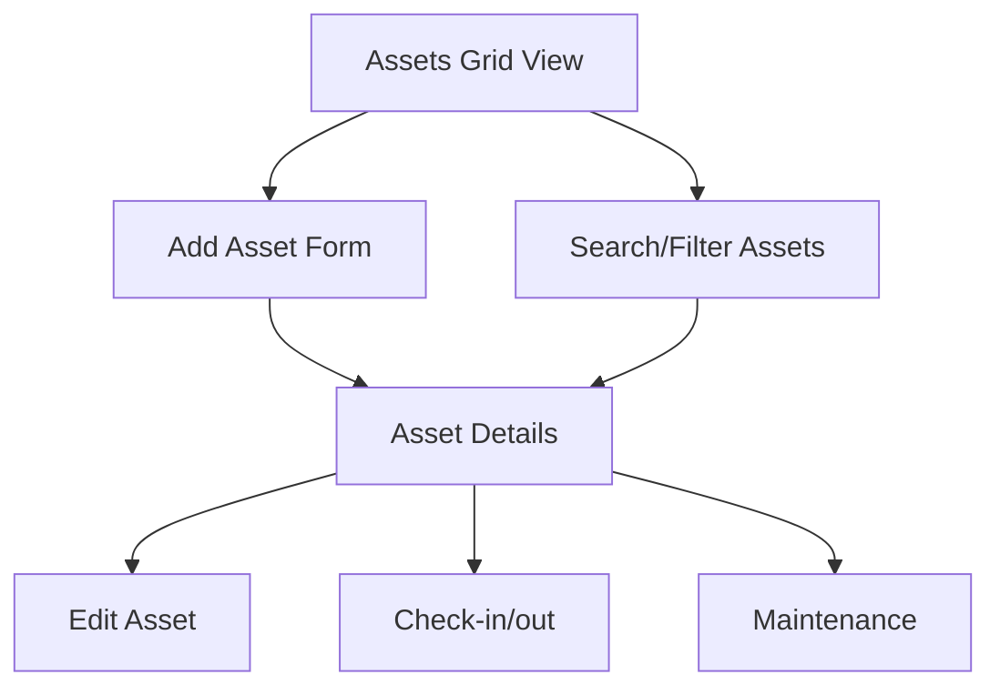

## 1. Product Overview

Transform the existing asset tracking table view into a modern, card-based grid interface with enhanced filtering, search capabilities, and improved asset management workflow. This redesign aims to improve user experience by making asset information more visually accessible and interactions more intuitive.

The product serves asset managers and administrators who need to efficiently track, search, and manage company assets across multiple locations and categories.

## 2. Core Features

### 2.1 User Roles

| Role          | Registration Method | Core Permissions                                  |
| ------------- | ------------------- | ------------------------------------------------- |
| Asset Manager | Email registration  | Full asset CRUD, bulk operations, reporting       |
| Administrator | Admin invitation    | System configuration, user management, audit logs |
| Technician    | Manager assignment  | Asset check-in/out, maintenance updates           |
| Viewer        | Read-only access    | View assets, search, export reports               |

### 2.2 Feature Module

Our asset tracking UI transformation consists of the following main pages:

1. **Assets Grid View**: Card-based asset display with visual thumbnails, status indicators, and quick actions
2. **Asset Details**: Comprehensive asset information with edit capabilities and history tracking
3. **Add Asset Form**: Streamlined asset registration with image upload and categorization

### 2.3 Page Details

| Page Name        | Module Name       | Feature description                                                                                         |
| ---------------- | ----------------- | ----------------------------------------------------------------------------------------------------------- |
| Assets Grid View | Search Bar        | Filter assets by name, tag, or description with real-time results                                           |
| Assets Grid View | Category Filter   | Dropdown filter for Electronics, Furniture, Vehicles, Equipment, Software categories                        |
| Assets Grid View | Status Filter     | Filter by Available, In Use, Maintenance, Retired statuses                                                  |
| Assets Grid View | View Toggle       | Switch between grid and list view layouts                                                                   |
| Assets Grid View | Asset Cards       | Display asset image, name, tag, status pill, category pill, location, assigned person, and acquisition date |
| Assets Grid View | Quick Actions     | Add Asset button with prominent purple styling                                                              |
| Assets Grid View | Card Navigation   | Click card to view detailed asset information                                                               |
| Asset Details    | Asset Image       | Large thumbnail with upload/replace capability                                                              |
| Asset Details    | Basic Information | Asset name, tag, category, status, location, assigned person                                                |
| Asset Details    | Purchase Details  | Purchase date, cost, manufacturer, model, serial number                                                     |
| Asset Details    | Notes Section     | Multi-line text area for additional information                                                             |
| Asset Details    | Action Buttons    | Edit, Delete, Check-in/out, Maintenance scheduling                                                          |
| Add Asset Form   | Image Upload      | Drag-and-drop or click-to-upload with preview                                                               |
| Add Asset Form   | Required Fields   | Asset name, asset tag, category, status (marked with asterisk)                                              |
| Add Asset Form   | Optional Fields   | Location, assigned person, purchase details, manufacturer, model, serial number, notes                      |
| Add Asset Form   | Form Validation   | Real-time validation with error messages for required fields                                                |
| Add Asset Form   | Success Handling  | Redirect to asset details page after successful creation                                                    |

## 3. Core Process

**Asset Manager Flow:**

1. Navigate to Assets page to view all assets in grid layout
2. Use search bar or filters to find specific assets
3. Click "Add Asset" button to register new asset
4. Fill out form with required information and upload image
5. View newly created asset in grid and click for details
6. Update asset status, location, or assignment as needed

**Administrator Flow:**

1. Access comprehensive asset dashboard with all organizational assets
2. Configure categories, locations, and status options
3. Generate reports and export asset data
4. Manage user permissions and access levels

## 4. User Interface Design

### 4.1 Design Style

* **Primary Colors**: Purple (#7C3AED) for primary actions and accents

* **Secondary Colors**: Green (#10B981) for available status, Yellow (#F59E0B) for maintenance, Blue (#3B82F6) for in-use status

* **Button Style**: Rounded corners (8px), prominent shadows on hover

* **Typography**: Clean sans-serif, 14-16px for body text, 20-24px for headers

* **Card Design**: White background, subtle shadows (0 1px 3px rgba(0,0,0,0.1)), 8px border radius

* **Status Pills**: Rounded pills with soft background colors and dark text

* **Icons**: Minimal line icons for location, person, calendar indicators

### 4.2 Page Design Overview

| Page Name        | Module Name    | UI Elements                                                                                                              |
| ---------------- | -------------- | ------------------------------------------------------------------------------------------------------------------------ |
| Assets Grid View | Header         | Large "Assets" title with asset count, search bar with magnifying glass icon                                             |
| Assets Grid View | Filters        | Category dropdown, Status dropdown, View toggle icons (grid/list)                                                        |
| Assets Grid View | Asset Cards    | 3-column responsive grid, avatar circles with initials, asset name as clickable title, colored status and category pills |
| Assets Grid View | Card Footer    | Location with map pin icon, assigned person with user icon, calendar with date icon                                      |
| Add Asset Form   | Form Container | Rounded white card with subtle shadow, two-column layout on desktop                                                      |
| Add Asset Form   | Image Upload   | Dashed border upload area with upload arrow icon, "Upload" text prompt                                                   |
| Add Asset Form   | Input Fields   | Light gray borders, rounded corners, required field indicators                                                           |
| Add Asset Form   | Dropdowns      | Chevron indicators, rounded menus with shadow effects                                                                    |

### 4.3 Responsiveness

* **Desktop-first** approach with 3-column grid layout

* **Tablet**: 2-column grid with maintained functionality

* **Mobile**: Single column stack with card-based layout

* **Touch optimization** for mobile interactions with larger tap targets

* **Responsive forms** that stack vertically on smaller screens

### 4.4 Visual Hierarchy

* **Primary Actions**: Purple "Add Asset" button prominently positioned

* **Status Indicators**: Color-coded pills for immediate status recognition

* **Card Layout**: Consistent spacing and alignment across all asset cards

* **Typography Hierarchy**: Clear distinction between headers, titles, and body text

* **Interactive Elements**: Hover states and visual feedback for all clickable components

