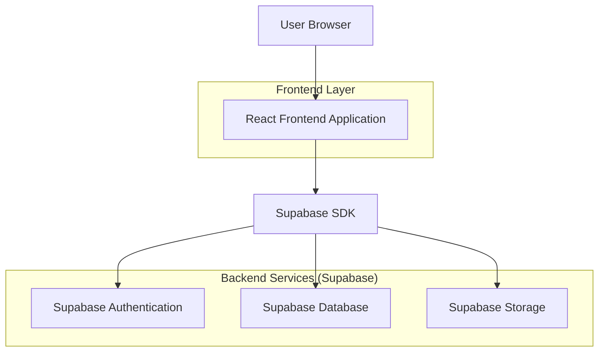
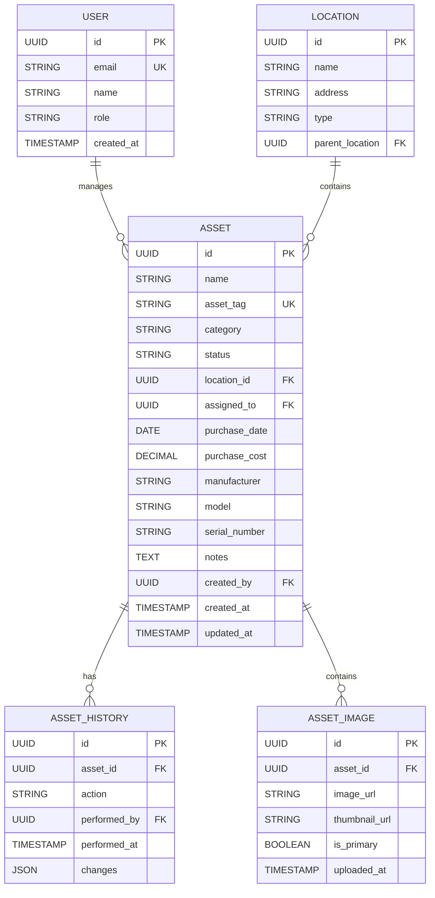

## 1. Architecture Design



## 2. Technology Description

- **Frontend**: React@18 + TypeScript + TailwindCSS@3 + Vite
- **Initialization Tool**: vite-init
- **Backend**: Supabase (PostgreSQL, Authentication, Storage)
- **UI Components**: HeadlessUI for accessible components
- **State Management**: React Context + custom hooks
- **Image Processing**: Browser-native File API with compression

## 3. Route Definitions

| Route | Purpose |
|-------|---------|
| /assets | Main assets grid view with search and filters |
| /assets/new | Add new asset form with image upload |
| /assets/:id | Asset details page with edit capabilities |
| /assets/:id/edit | Asset edit form with pre-populated data |

## 4. API Definitions

### 4.1 Asset Management APIs

**Get Assets with Filters**
```
GET /api/assets?search={searchTerm}&category={category}&status={status}&view={grid|list}
```

Request Parameters:
| Param Name | Param Type | isRequired | Description |
|------------|------------|------------|-------------|
| search | string | false | Search term for asset name, tag, or description |
| category | string | false | Filter by category (Electronics, Furniture, Vehicles, Equipment, Software) |
| status | string | false | Filter by status (Available, In_Use, Maintenance, Retired) |
| view | string | false | View layout type (grid or list) |

Response:
```json
{
  "assets": [
    {
      "id": "uuid",
      "name": "MacBook Pro 16",
      "asset_tag": "AST-001",
      "category": "Electronics",
      "status": "In_Use",
      "location": "Building A, Floor 2",
      "assigned_to": "Sarah Johnson",
      "image_url": "https://storage.supabase.co/asset-images/uuid.jpg",
      "purchase_date": "2024-01-15",
      "created_at": "2024-01-15T10:30:00Z"
    }
  ],
  "total_count": 6,
  "filters_applied": {
    "category": "Electronics",
    "status": "In_Use"
  }
}
```

**Create New Asset**
```
POST /api/assets
```

Request:
```json
{
  "name": "MacBook Pro 16",
  "asset_tag": "AST-001",
  "category": "Electronics",
  "status": "Available",
  "location": "Building A, Floor 2",
  "assigned_to": "John Doe",
  "purchase_date": "2024-01-15",
  "purchase_cost": 2499.00,
  "manufacturer": "Apple",
  "model": "MacBook Pro 16-inch",
  "serial_number": "C02XL2KVJHD4",
  "notes": "Additional information about this asset"
}
```

**Upload Asset Image**
```
POST /api/assets/:id/image
```

Request:
| Param Name | Param Type | isRequired | Description |
|------------|------------|------------|-------------|
| image | File | true | Asset image file (JPEG, PNG, max 5MB) |

Response:
```json
{
  "image_url": "https://storage.supabase.co/asset-images/uuid.jpg",
  "thumbnail_url": "https://storage.supabase.co/asset-images/uuid-thumb.jpg"
}
```

## 5. Data Model

### 5.1 Database Schema



### 5.2 Data Definition Language

**Assets Table**
```sql
-- Create assets table
CREATE TABLE assets (
  id UUID PRIMARY KEY DEFAULT gen_random_uuid(),
  name VARCHAR(255) NOT NULL,
  asset_tag VARCHAR(100) UNIQUE NOT NULL,
  category VARCHAR(50) NOT NULL CHECK (category IN ('Electronics', 'Furniture', 'Vehicles', 'Equipment', 'Software')),
  status VARCHAR(20) NOT NULL CHECK (status IN ('Available', 'In_Use', 'Maintenance', 'Retired')),
  location_id UUID REFERENCES locations(id),
  assigned_to UUID REFERENCES users(id),
  purchase_date DATE,
  purchase_cost DECIMAL(10,2),
  manufacturer VARCHAR(100),
  model VARCHAR(100),
  serial_number VARCHAR(100),
  notes TEXT,
  created_by UUID REFERENCES users(id),
  created_at TIMESTAMP WITH TIME ZONE DEFAULT NOW(),
  updated_at TIMESTAMP WITH TIME ZONE DEFAULT NOW()
);

-- Create indexes
CREATE INDEX idx_assets_category ON assets(category);
CREATE INDEX idx_assets_status ON assets(status);
CREATE INDEX idx_assets_location ON assets(location_id);
CREATE INDEX idx_assets_assigned ON assets(assigned_to);
CREATE INDEX idx_assets_search ON assets USING gin(to_tsvector('english', name || ' ' || asset_tag));

-- Grant permissions
GRANT SELECT ON assets TO anon;
GRANT ALL PRIVILEGES ON assets TO authenticated;
```

**Asset Images Table**
```sql
-- Create asset_images table
CREATE TABLE asset_images (
  id UUID PRIMARY KEY DEFAULT gen_random_uuid(),
  asset_id UUID REFERENCES assets(id) ON DELETE CASCADE,
  image_url TEXT NOT NULL,
  thumbnail_url TEXT NOT NULL,
  is_primary BOOLEAN DEFAULT false,
  uploaded_at TIMESTAMP WITH TIME ZONE DEFAULT NOW()
);

-- Create index
CREATE INDEX idx_asset_images_asset ON asset_images(asset_id);
CREATE INDEX idx_asset_images_primary ON asset_images(asset_id, is_primary) WHERE is_primary = true;

-- Grant permissions
GRANT SELECT ON asset_images TO anon;
GRANT ALL PRIVILEGES ON asset_images TO authenticated;
```

**Locations Table**
```sql
-- Create locations table
CREATE TABLE locations (
  id UUID PRIMARY KEY DEFAULT gen_random_uuid(),
  name VARCHAR(255) NOT NULL,
  address TEXT,
  type VARCHAR(50) CHECK (type IN ('Building', 'Floor', 'Room', 'Warehouse', 'External')),
  parent_location UUID REFERENCES locations(id),
  created_at TIMESTAMP WITH TIME ZONE DEFAULT NOW()
);

-- Grant permissions
GRANT SELECT ON locations TO anon;
GRANT ALL PRIVILEGES ON locations TO authenticated;
```

## 6. Frontend Implementation Details

### 6.1 Component Structure
- **AssetGrid**: Main grid container with responsive layout
- **AssetCard**: Individual asset card with image, status pills, and metadata
- **AssetFilters**: Search bar and filter dropdowns with state management
- **AssetForm**: Multi-step form with image upload and validation
- **ImageUploader**: Drag-and-drop file upload with preview and compression

### 6.2 State Management
- **AssetContext**: Global asset data and filtering state
- **FilterContext**: Search terms, category, and status filters
- **UIContext**: View mode (grid/list), loading states, notifications

### 6.3 Performance Optimizations
- **Image Optimization**: Automatic compression and thumbnail generation
- **Pagination**: Load assets in batches with infinite scroll
- **Caching**: Browser caching for asset images and metadata
- **Debounced Search**: 300ms delay on search input to reduce API calls