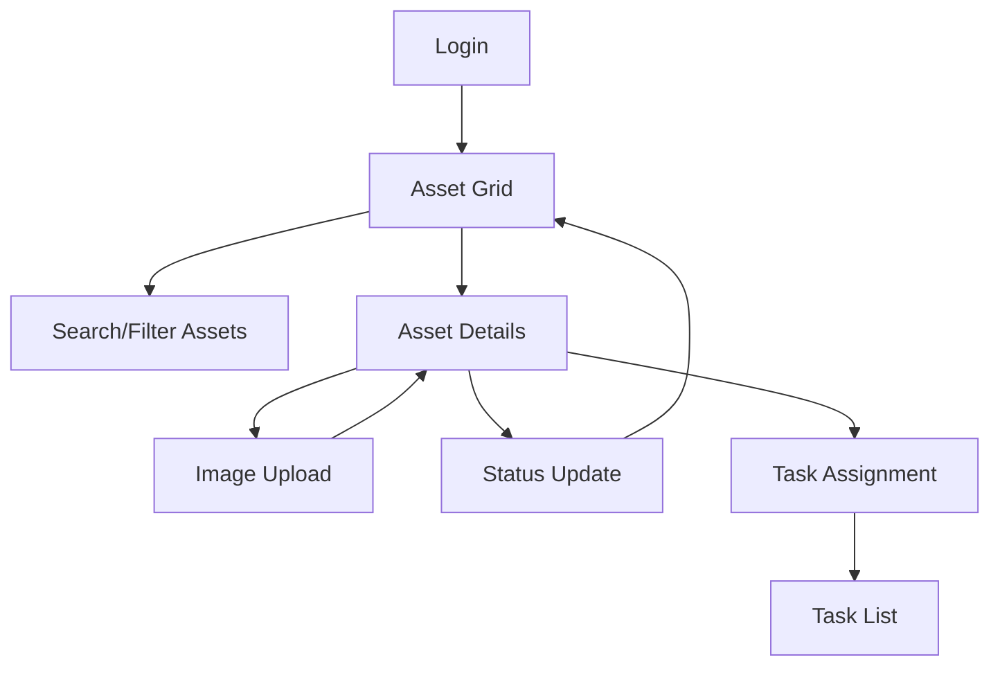

## 1. Product Overview
Technician mobile application for asset management and maintenance tracking. Enables field technicians to view, search, and update asset information with image documentation capabilities.
- Solves the problem of efficient asset management in the field with offline-first approach
- Target users: Field technicians, maintenance staff, service engineers

## 2. Core Features

### 2.1 User Roles
| Role | Registration Method | Core Permissions |
|------|---------------------|------------------|
| Technician | Admin assignment/Email registration | View assets, update status, upload images, search/filter assets |
| Supervisor | Admin assignment | All technician permissions + assign tasks, view reports |

### 2.2 Feature Module
Our technician app requirements consist of the following main pages:
1. **Asset Grid**: Card-based asset display with search and filter capabilities
2. **Asset Details**: Detailed asset information with image gallery
3. **Image Upload**: Camera/photo library integration for asset documentation
4. **Task List**: Assigned maintenance tasks with status tracking

### 2.3 Page Details
| Page Name | Module Name | Feature description |
|-----------|-------------|---------------------|
| Asset Grid | Card Display | Display assets in responsive card grid layout with thumbnail images, asset name, ID, and status indicators |
| Asset Grid | Search Bar | Real-time search by asset name, ID, location with instant filtering |
| Asset Grid | Filter Panel | Filter by status (active/inactive), category, location, assigned technician with multi-select options |
| Asset Grid | Sort Options | Sort by name, date, status, priority with ascending/descending toggle |
| Asset Details | Asset Info | Display comprehensive asset details including specifications, maintenance history, current status |
| Asset Details | Image Gallery | Swipeable image carousel showing all uploaded asset photos with zoom capability |
| Asset Details | Status Update | Update asset status with timestamp and technician notes |
| Image Upload | Camera Integration | Direct camera access for capturing asset condition photos with auto-focus and flash controls |
| Image Upload | Photo Library | Access device photo library for selecting existing images |
| Image Upload | Image Preview | Preview captured/selected images with basic editing (crop, rotate, brightness) |
| Task List | Task Cards | Display assigned tasks in card format with priority indicators and due dates |
| Task List | Task Status | Mark tasks as in-progress, completed, or requires follow-up with timestamp |

## 3. Core Process
**Technician Workflow:**
1. Login with credentials
2. View asset grid with search/filter capabilities
3. Select asset to view details and maintenance history
4. Capture/upload images of asset condition
5. Update asset status and add maintenance notes
6. View and update assigned tasks

**Supervisor Workflow:**
1. Access all technician features
2. Assign tasks to technicians
3. Generate maintenance reports
4. Review uploaded images and status updates

## 4. User Interface Design

### 4.1 Design Style
- **Primary Colors**: Blue (#2196F3) for primary actions, Green (#4CAF50) for success states
- **Secondary Colors**: Gray (#757575) for secondary text, Orange (#FF9800) for warnings
- **Card Style**: Rounded corners (8px), subtle shadows, white background with 1px border
- **Typography**: Roboto font family, 16px base size, clear hierarchy with bold headers
- **Icons**: Material Design icons for consistency and recognition
- **Layout**: Mobile-first responsive design with card-based components

### 4.2 Page Design Overview
| Page Name | Module Name | UI Elements |
|-----------|-------------|-------------|
| Asset Grid | Card Display | 2-column grid on mobile, 3-4 column on tablet/desktop, 150x150px thumbnails, status badges with color coding |
| Asset Grid | Search Bar | Full-width search bar with magnifying glass icon, placeholder text "Search assets...", instant search feedback |
| Asset Grid | Filter Panel | Slide-up bottom sheet on mobile, sidebar on desktop, chip-based filter selections |
| Asset Details | Header | Large asset image with gradient overlay, asset name in bold, back navigation button |
| Asset Details | Info Sections | Collapsible sections for different information categories, material design expansion panels |
| Image Upload | Camera View | Full-screen camera interface with capture button, flash toggle, gallery access button |
| Image Upload | Preview | Full-screen image preview with edit toolbar at bottom, save/cancel actions |

### 4.3 Responsiveness
Mobile-first design approach with responsive breakpoints:
- Mobile: 320px - 768px (single column layouts)
- Tablet: 768px - 1024px (2-column grid layouts)
- Desktop: 1024px+ (multi-column layouts with sidebar navigation)
Touch-optimized interactions with large tap targets (minimum 48px), swipe gestures for image gallery navigation

### 4.4 Offline Capabilities
- Cache asset data for offline viewing
- Queue image uploads when offline
- Sync data when connection restored
- Local storage for user preferences and filters