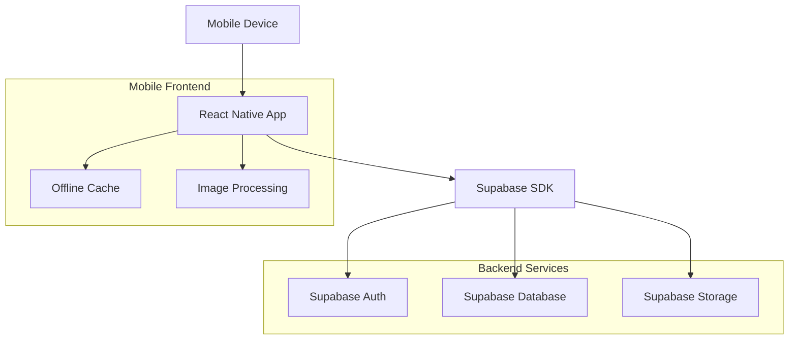
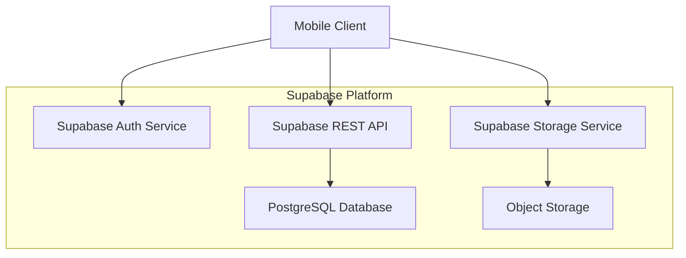
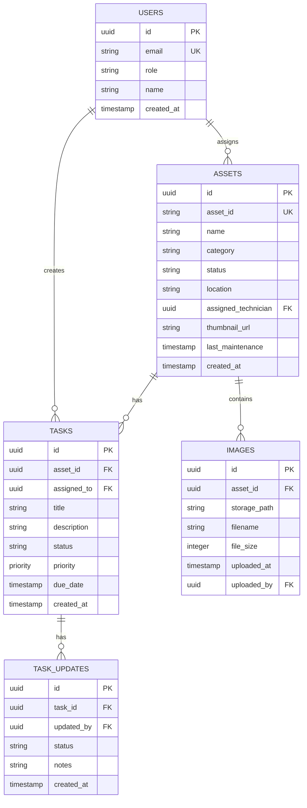

## 1. Architecture Design



## 2. Technology Description

- **Frontend**: React Native@0.72 + TypeScript + NativeWind (Tailwind for React Native)
- **Initialization Tool**: React Native CLI
- **Backend**: Supabase (PostgreSQL, Auth, Storage)
- **State Management**: Zustand for global state
- **Image Handling**: react-native-image-picker, react-native-compressor
- **Offline Support**: @react-native-async-storage/async-storage
- **Navigation**: @react-navigation/native with stack and bottom tab navigators

## 3. Route Definitions

| Route | Purpose |
|-------|---------|
| /login | Authentication screen for technician login |
| /assets | Main asset grid view with search and filters |
| /assets/:id | Detailed asset view with image gallery |
| /assets/:id/upload | Image upload interface for asset documentation |
| /tasks | Technician task list and assignments |
| /profile | User profile and settings |

## 4. API Definitions

### 4.1 Authentication APIs

**Login**
```
POST /auth/v1/token?grant_type=password
```

Request:
| Param Name | Param Type | isRequired | Description |
|------------|------------|------------|-------------|
| email | string | true | Technician email address |
| password | string | true | Account password |

Response:
```json
{
  "access_token": "eyJhbGciOiJIUzI1NiIsInR5cCI6IkpXVCJ9...",
  "token_type": "bearer",
  "expires_in": 3600,
  "refresh_token": "tGzv3JOkF0XG5Qx2TlKWIA",
  "user": {
    "id": "user-uuid",
    "email": "tech@company.com",
    "role": "technician"
  }
}
```

### 4.2 Asset APIs

**Get Assets with Filters**
```
GET /rest/v1/assets?status=eq.active&location=eq.warehouse
```

Query Parameters:
| Param Name | Param Type | isRequired | Description |
|------------|------------|------------|-------------|
| search | string | false | Search term for name/ID |
| status | string | false | Filter by asset status |
| category | string | false | Filter by category |
| location | string | false | Filter by location |
| technician_id | uuid | false | Filter by assigned technician |

Response:
```json
[
  {
    "id": "asset-uuid",
    "name": "HVAC Unit #1",
    "asset_id": "HVAC-001",
    "status": "active",
    "category": "hvac",
    "location": "warehouse",
    "thumbnail_url": "https://storage.supabase.co/...",
    "last_maintenance": "2024-01-15",
    "assigned_technician": "tech-uuid"
  }
]
```

**Update Asset Status**
```
PATCH /rest/v1/assets?id=eq.asset-uuid
```

Request:
```json
{
  "status": "maintenance",
  "last_updated": "2024-01-20T10:30:00Z",
  "technician_notes": "Filter replacement needed"
}
```

### 4.3 Image Upload APIs

**Upload Asset Image**
```
POST /storage/v1/object/assets/{asset_id}/{filename}
```

Request Headers:
- Authorization: Bearer {access_token}
- Content-Type: image/jpeg

Response:
```json
{
  "Key": "assets/asset-uuid/image-123.jpg",
  "ETag": "\"d41d8cd98f00b204e9800998ecf8427e\""
}
```

## 5. Server Architecture Diagram



## 6. Data Model

### 6.1 Data Model Definition



### 6.2 Data Definition Language

**Users Table**
```sql
-- create table
CREATE TABLE users (
  id UUID PRIMARY KEY DEFAULT gen_random_uuid(),
  email VARCHAR(255) UNIQUE NOT NULL,
  role VARCHAR(20) NOT NULL CHECK (role IN ('technician', 'supervisor')),
  name VARCHAR(100) NOT NULL,
  created_at TIMESTAMP WITH TIME ZONE DEFAULT NOW()
);

-- enable RLS
ALTER TABLE users ENABLE ROW LEVEL SECURITY;

-- create policies
CREATE POLICY "Users can view their own profile" ON users
  FOR SELECT USING (auth.uid() = id);

CREATE POLICY "Supervisors can view all users" ON users
  FOR SELECT USING (EXISTS (
    SELECT 1 FROM users WHERE id = auth.uid() AND role = 'supervisor'
  ));
```

**Assets Table**
```sql
-- create table
CREATE TABLE assets (
  id UUID PRIMARY KEY DEFAULT gen_random_uuid(),
  asset_id VARCHAR(50) UNIQUE NOT NULL,
  name VARCHAR(200) NOT NULL,
  category VARCHAR(50) NOT NULL,
  status VARCHAR(20) NOT NULL DEFAULT 'active',
  location VARCHAR(100),
  assigned_technician UUID REFERENCES users(id),
  thumbnail_url TEXT,
  last_maintenance TIMESTAMP WITH TIME ZONE,
  created_at TIMESTAMP WITH TIME ZONE DEFAULT NOW(),
  updated_at TIMESTAMP WITH TIME ZONE DEFAULT NOW()
);

-- create indexes
CREATE INDEX idx_assets_status ON assets(status);
CREATE INDEX idx_assets_category ON assets(category);
CREATE INDEX idx_assets_location ON assets(location);
CREATE INDEX idx_assets_technician ON assets(assigned_technician);

-- enable RLS
ALTER TABLE assets ENABLE ROW LEVEL SECURITY;

-- create policies
CREATE POLICY "Anyone can view assets" ON assets
  FOR SELECT USING (true);

CREATE POLICY "Technicians can update assigned assets" ON assets
  FOR UPDATE USING (
    assigned_technician = auth.uid() OR 
    EXISTS (
      SELECT 1 FROM users WHERE id = auth.uid() AND role = 'supervisor'
    )
  )
  WITH CHECK (true);
```

**Images Table**
```sql
-- create table
CREATE TABLE images (
  id UUID PRIMARY KEY DEFAULT gen_random_uuid(),
  asset_id UUID NOT NULL REFERENCES assets(id) ON DELETE CASCADE,
  storage_path TEXT NOT NULL,
  filename VARCHAR(255) NOT NULL,
  file_size INTEGER,
  uploaded_at TIMESTAMP WITH TIME ZONE DEFAULT NOW(),
  uploaded_by UUID NOT NULL REFERENCES users(id)
);

-- create indexes
CREATE INDEX idx_images_asset_id ON images(asset_id);
CREATE INDEX idx_images_uploaded_by ON images(uploaded_by);

-- enable RLS
ALTER TABLE images ENABLE ROW LEVEL SECURITY;

-- create policies
CREATE POLICY "Anyone can view images" ON images
  FOR SELECT USING (true);

CREATE POLICY "Authenticated users can upload images" ON images
  FOR INSERT WITH CHECK (auth.uid() = uploaded_by);

CREATE POLICY "Users can delete their own images" ON images
  FOR DELETE USING (auth.uid() = uploaded_by);
```

**Tasks Table**
```sql
-- create table
CREATE TABLE tasks (
  id UUID PRIMARY KEY DEFAULT gen_random_uuid(),
  asset_id UUID NOT NULL REFERENCES assets(id),
  assigned_to UUID NOT NULL REFERENCES users(id),
  title VARCHAR(200) NOT NULL,
  description TEXT,
  status VARCHAR(20) NOT NULL DEFAULT 'pending',
  priority VARCHAR(10) NOT NULL DEFAULT 'medium' CHECK (priority IN ('low', 'medium', 'high')),
  due_date TIMESTAMP WITH TIME ZONE,
  created_at TIMESTAMP WITH TIME ZONE DEFAULT NOW(),
  updated_at TIMESTAMP WITH TIME ZONE DEFAULT NOW()
);

-- create indexes
CREATE INDEX idx_tasks_assigned_to ON tasks(assigned_to);
CREATE INDEX idx_tasks_status ON tasks(status);
CREATE INDEX idx_tasks_due_date ON tasks(due_date);

-- enable RLS
ALTER TABLE tasks ENABLE ROW LEVEL SECURITY;

-- create policies
CREATE POLICY "Users can view their own tasks" ON tasks
  FOR SELECT USING (
    assigned_to = auth.uid() OR 
    EXISTS (
      SELECT 1 FROM users WHERE id = auth.uid() AND role = 'supervisor'
    )
  );

CREATE POLICY "Users can update their own tasks" ON tasks
  FOR UPDATE USING (assigned_to = auth.uid())
  WITH CHECK (true);

CREATE POLICY "Supervisors can manage all tasks" ON tasks
  FOR ALL USING (
    EXISTS (
      SELECT 1 FROM users WHERE id = auth.uid() AND role = 'supervisor'
    )
  );
```

## 7. Mobile-Specific Considerations

### 7.1 Offline Architecture
- Implement Redux Persist or similar for offline data caching
- Queue API calls when offline and sync when connection restored
- Cache recently viewed assets and images
- Implement optimistic updates for better UX

### 7.2 Image Optimization
- Compress images before upload (target <2MB)
- Generate multiple sizes for thumbnails and full resolution
- Implement lazy loading for image galleries
- Cache images locally to reduce bandwidth usage

### 7.3 Performance Optimization
- Implement virtual scrolling for large asset lists
- Use React.memo for expensive components
- Optimize image loading with progressive loading
- Implement pull-to-refresh for data synchronization