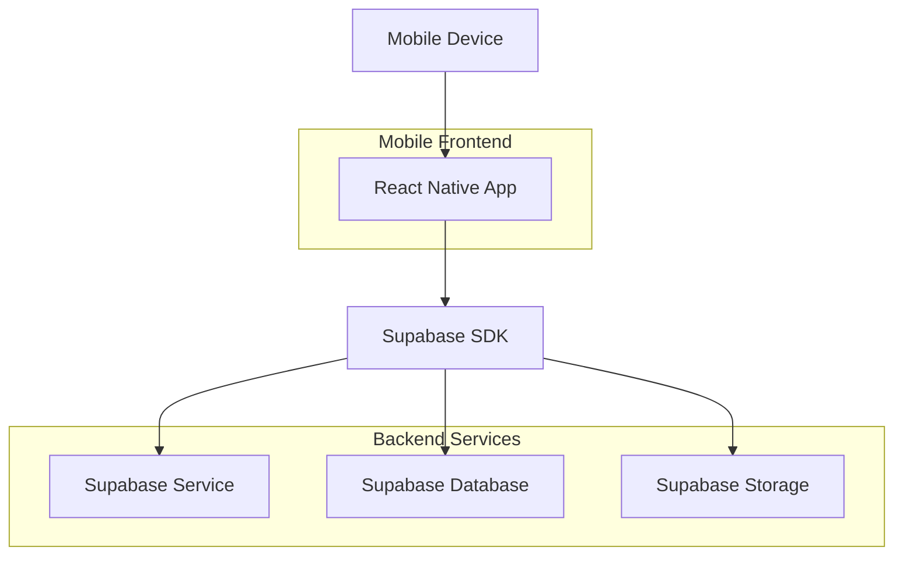
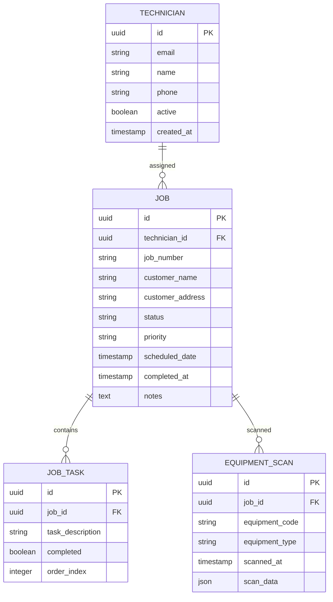

## 1. Architecture design



## 2. Technology Description
- **Frontend**: React Native@0.72 + React Navigation@6 + Native Base@3
- **Backend**: Supabase (PostgreSQL database, Authentication, Storage)
- **Additional Libraries**: react-native-camera, react-native-qrcode-scanner, react-native-svg

## 3. Route definitions
| Route | Purpose |
|-------|---------|
| / | Login screen |
| /home | Dashboard with job summary |
| /jobs | List of assigned jobs |
| /jobs/:id | Job details and completion workflow |
| /scan | QR/barcode scanner |
| /account | User profile and settings |

## 4. API definitions

### 4.1 Authentication APIs
```
POST /auth/v1/token
```

Request:
| Param Name| Param Type  | isRequired  | Description |
|-----------|-------------|-------------|-------------|
| email     | string      | true        | Technician email address |
| password  | string      | true        | Account password |

Response:
| Param Name| Param Type  | Description |
|-----------|-------------|-------------|
| access_token | string  | JWT token for API access |
| user      | object      | User profile information |

## 5. Data model

### 5.1 Data model definition


### 5.2 Data Definition Language
Technician Table (technicians)
```sql
CREATE TABLE technicians (
    id UUID PRIMARY KEY DEFAULT gen_random_uuid(),
    email VARCHAR(255) UNIQUE NOT NULL,
    name VARCHAR(100) NOT NULL,
    phone VARCHAR(20),
    active BOOLEAN DEFAULT true,
    created_at TIMESTAMP WITH TIME ZONE DEFAULT NOW(),
    updated_at TIMESTAMP WITH TIME ZONE DEFAULT NOW()
);

-- Grant permissions
GRANT SELECT ON technicians TO anon;
GRANT ALL PRIVILEGES ON technicians TO authenticated;
```

Jobs Table (jobs)
```sql
CREATE TABLE jobs (
    id UUID PRIMARY KEY DEFAULT gen_random_uuid(),
    technician_id UUID REFERENCES technicians(id),
    job_number VARCHAR(50) UNIQUE NOT NULL,
    customer_name VARCHAR(255) NOT NULL,
    customer_address TEXT,
    status VARCHAR(20) DEFAULT 'pending' CHECK (status IN ('pending', 'in_progress', 'completed', 'cancelled')),
    priority VARCHAR(10) DEFAULT 'medium' CHECK (priority IN ('low', 'medium', 'high')),
    scheduled_date TIMESTAMP WITH TIME ZONE,
    completed_at TIMESTAMP WITH TIME ZONE,
    notes TEXT,
    created_at TIMESTAMP WITH TIME ZONE DEFAULT NOW(),
    updated_at TIMESTAMP WITH TIME ZONE DEFAULT NOW()
);

-- Grant permissions
GRANT SELECT ON jobs TO anon;
GRANT ALL PRIVILEGES ON jobs TO authenticated;
```

Job Tasks Table (job_tasks)
```sql
CREATE TABLE job_tasks (
    id UUID PRIMARY KEY DEFAULT gen_random_uuid(),
    job_id UUID REFERENCES jobs(id) ON DELETE CASCADE,
    task_description TEXT NOT NULL,
    completed BOOLEAN DEFAULT false,
    order_index INTEGER DEFAULT 0,
    created_at TIMESTAMP WITH TIME ZONE DEFAULT NOW()
);

-- Grant permissions
GRANT SELECT ON job_tasks TO anon;
GRANT ALL PRIVILEGES ON job_tasks TO authenticated;
```

Equipment Scans Table (equipment_scans)
```sql
CREATE TABLE equipment_scans (
    id UUID PRIMARY KEY DEFAULT gen_random_uuid(),
    job_id UUID REFERENCES jobs(id) ON DELETE CASCADE,
    equipment_code VARCHAR(100) NOT NULL,
    equipment_type VARCHAR(50),
    scanned_at TIMESTAMP WITH TIME ZONE DEFAULT NOW(),
    scan_data JSONB,
    created_at TIMESTAMP WITH TIME ZONE DEFAULT NOW()
);

-- Grant permissions
GRANT SELECT ON equipment_scans TO anon;
GRANT ALL PRIVILEGES ON equipment_scans TO authenticated;
```