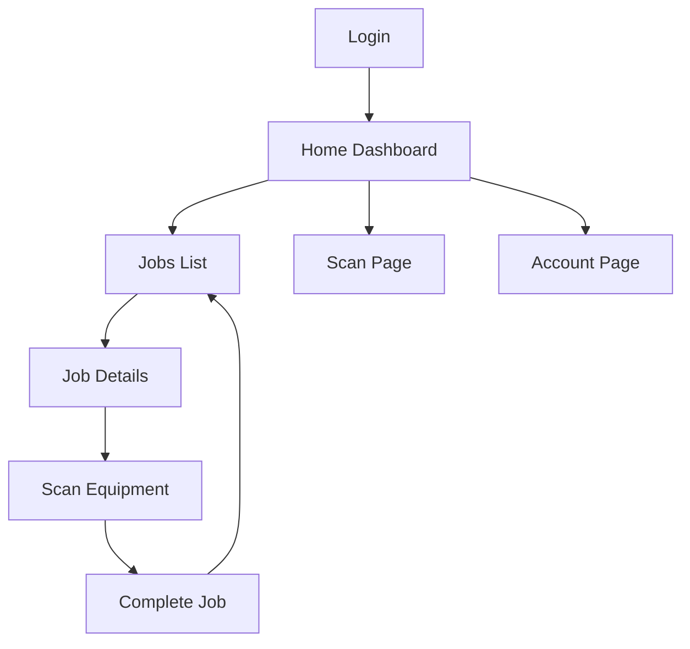

## 1. Product Overview
A mobile application for field technicians to manage their daily work orders and tasks. The app enables technicians to view assigned jobs, scan equipment, update job status, and manage their account information while on location.

## 2. Core Features

### 2.1 User Roles
| Role | Registration Method | Core Permissions |
|------|---------------------|------------------|
| Technician | Admin invitation/registration | View assigned jobs, update job status, scan equipment, manage profile |

### 2.2 Feature Module
Our technician app consists of the following main pages:
1. **Home page**: dashboard overview, today's job summary, quick actions.
2. **Jobs page**: job list, job details, job completion workflow.
3. **Scan page**: QR/barcode scanner, equipment lookup, scan history.
4. **Account page**: profile info, settings, logout.

### 2.3 Page Details
| Page Name | Module Name | Feature description |
|-----------|-------------|---------------------|
| Home | Dashboard | Display today's job count, active jobs, completed jobs. |
| Home | Quick Actions | Show shortcuts to scan equipment, view jobs, access profile. |
| Jobs | Job List | Show assigned jobs with status, priority, and due date. |
| Jobs | Job Details | Display job information, customer details, required tasks. |
| Jobs | Job Completion | Allow technicians to mark jobs complete, add notes, capture signature. |
| Scan | Scanner | Open camera for QR/barcode scanning with flashlight toggle. |
| Scan | Equipment Lookup | Show equipment details after successful scan. |
| Scan | Scan History | Display recent scan records with timestamps. |
| Account | Profile | Show technician name, ID, contact information. |
| Account | Settings | App preferences, notification settings, help section. |

## 3. Core Process
**Technician Flow**: Technician logs in → Views dashboard → Selects job → Scans equipment → Completes job → Updates status → Returns to jobs list

## 4. User Interface Design

### 4.1 Design Style
- **Primary Color**: #2563EB (Professional blue)
- **Secondary Color**: #10B981 (Success green)
- **Button Style**: Rounded corners with subtle shadows
- **Font**: System fonts (SF Pro for iOS, Roboto for Android)
- **Layout**: Card-based with bottom navigation
- **Icons**: Material Design icons for consistency

### 4.2 Page Design Overview
| Page Name | Module Name | UI Elements |
|-----------|-------------|-------------|
| Home | Dashboard | Card layout with job statistics, clean typography, status indicators. |
| Jobs | Job List | Scrollable list with status badges, priority indicators, swipe actions. |
| Jobs | Job Details | Header with job info, expandable task list, action buttons at bottom. |
| Scan | Scanner | Full-screen camera view with scan overlay, capture button centered. |
| Account | Profile | Avatar, info cards, settings list with icons. |

### 4.3 Responsiveness
Mobile-first design approach with touch-optimized interactions, swipe gestures, and thumb-friendly button placement for one-handed operation.